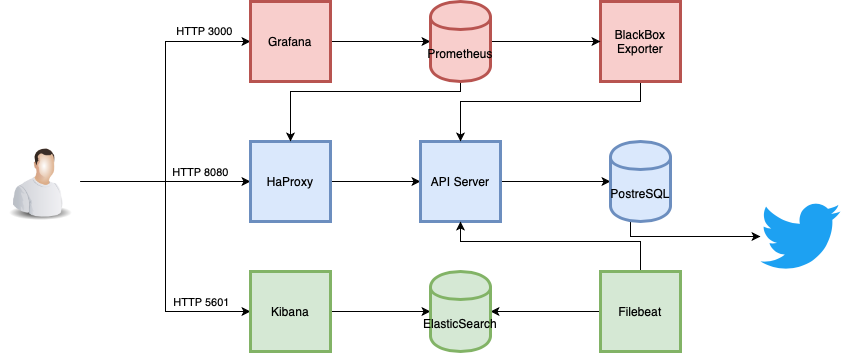
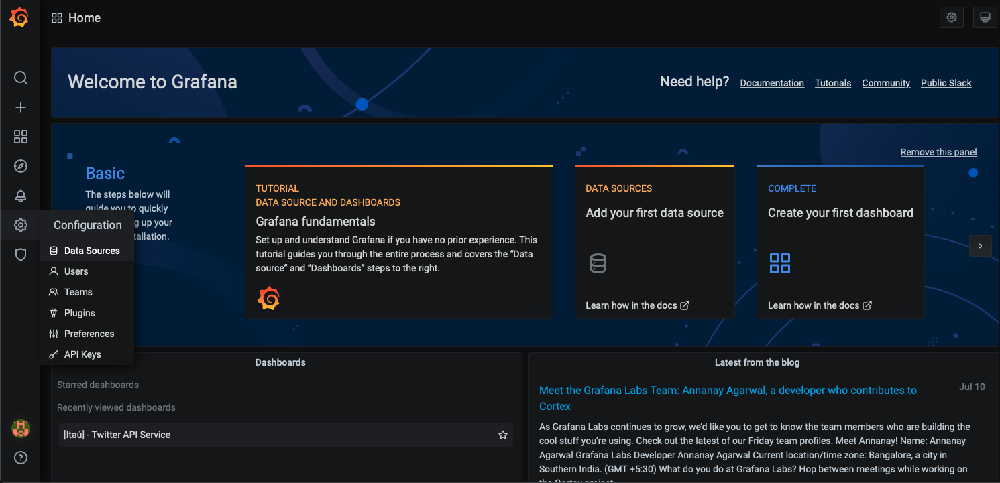
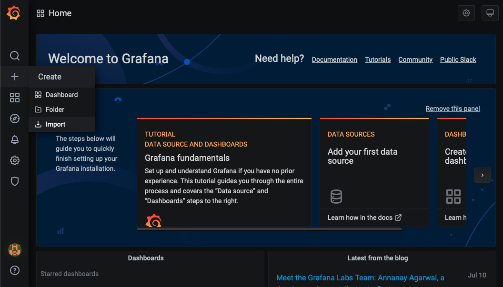
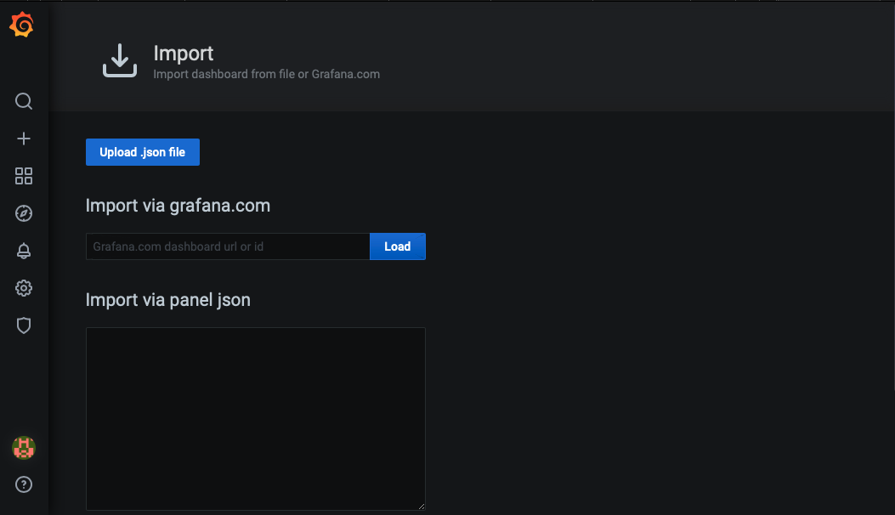
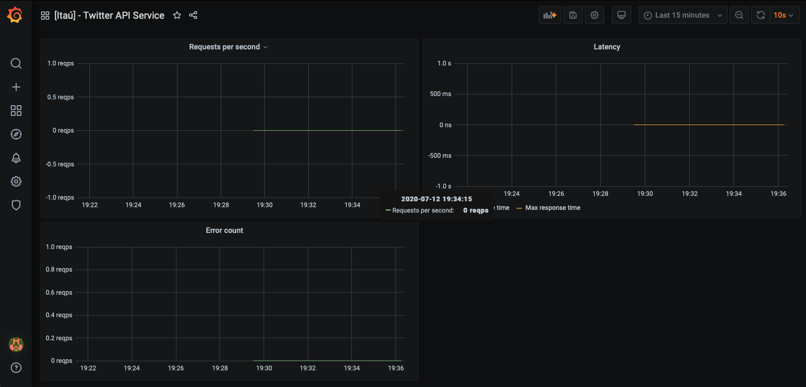
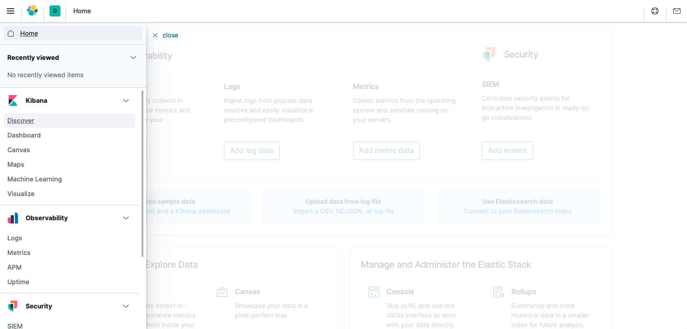
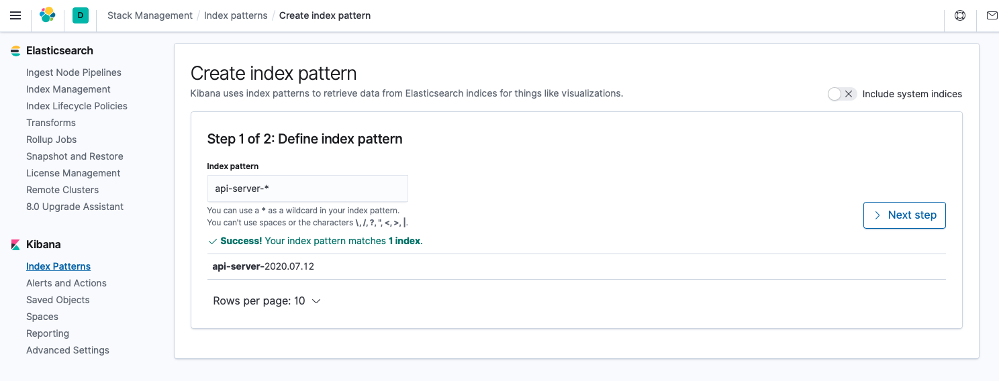
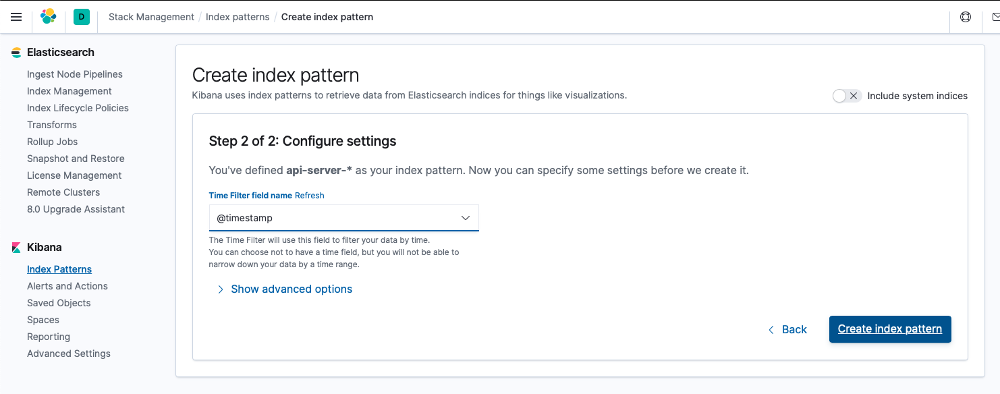
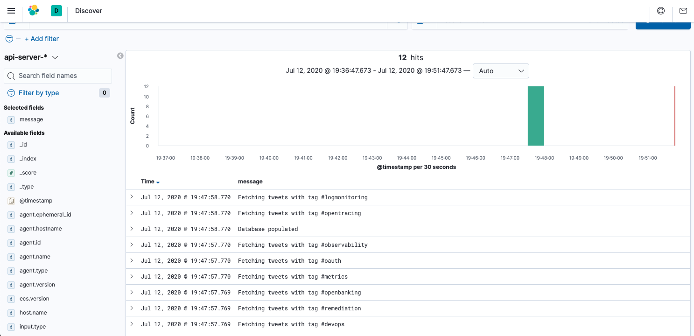

# Description
This project creats a Python service that fetches 100 tweets of each the following tags:
 - #openbanking 
 - #remediation
 - #devops
 - #sre
 - #microservices
 - #observability
 - #oauth
 - #metrics
 - #logmonitoring
 - #opentracing

Stores them in a PostgreSQL database and then serves 3 REST APIs that let's you consume the following views:
 - Top 5 users in the sample with the most followers
 - Amount of tweets per hour in the day on the sample
 - Amount of tweets per tag, language and country in the sample

There is also a Filebeat + ElasticSearch + Kiaban stack to capture and store and allow logs visualization.

Metrics observability and monitoring is achieved with Promethes + Blackbox exporter + HaProxy. 

# REST APIs
There are a grand total of 5 APIs exposed by the server:

1) `POST /api/v1/populate`
  
This is the first request you should make, as it will trigger the server to fetch the tweets from the Twitter API and store them in the database. Returns `HTTP 201` when OK and `HTTP 500` when error.

2) `GET /api/v1/users`

This will return an array with the 5 usernames and follower count in the sample with the most followers:

```
[] {
    "username": <string>,
    "followers": <int>
}
```

Returns `HTTP 200 ` when OK and `HTTP 500` when error.

3) `GET /api/v1/hour`

This will return an array with the timestamp aggregated by hour and the amount of tweets posted in each hour in the tweet samples:

```
[] {
    "date": <timestamp>,
    "count": <int>
}
```

Returns `HTTP 200 ` when OK and `HTTP 500` when error.

4) `GET /api/v1/tags`

Will return an array of #tag, country, language aggregated and the amount of tweets in each bin:

```
[] {
    "tag": <string>,
    "country": <string>,
    "language": <string>,
    "count": <int>
}
```

Returns `HTTP 200 ` when OK and `HTTP 500` when error.

5) `GET /api/health`

This is a simple health check endpoint for monitoring purposes that checks if the Twitter API and database conectvity are working.

Returns `HTTP 200 ` when OK and `HTTP 500` when one of the components failed.

A Postman collection with the 5 APIs requests is avaiable [here](postman_collection.json).

# Architecture overview


The core component is the API Server that fetches the tweets from the Twitter API, stores them in the PostgreSQL database and serves the APIs via HaProxy, as a reverse proxy), to consume the information stored in the database.

Logs are captured by Filebeat that sends them to ElasticSearch for storage and visualization by Kiabana.

Application metrics are fetched by the BlackBox Exporter and stored in the Prometheus TSDB and made avaiable to visualization by Grafana.

# How to run this project

You will need [Docker](https://docs.docker.com/get-docker/) and [Docker Compose](https://docs.docker.com/compose/install/) to run this project!

After clonning the project to your local environment, create a file named `twitter_keys` in the root of this project folder with the following content (replacing the values inside <> with your own):

```
TWITTER_CONSUMER_KEY=<YOUR-TWITTER-CONSUMER-KEY>
TWITTER_CONSUMER_SECRET=<YOUR-TWITTER-CONSUMER-SECRET>
TWITTER_APP_ACCESS_TOKEN=<YOUR-TWITTER-APP-ACCESS-TOKEN>
TWITTER_ACCESS_SECRET=<YOUR-TWITTER-ACCESS-SECRET>
```

then just execute the command:

`docker-compose up -d --build`

After a few minutes all the components should be up and ready to serve requests.

You can do requests do the API Server (via HaProxy reverse proxy) via `http://localhost:8080`.

# Metrics and Logs
When all the components are running, you can view application metrics in Grafana:

1) Access `http://localhost:3000`

2) When page loads for the first time, create a user and password 


3) When the main page loads, click on the cog in the left menu and choose Data Sources



4) Click in Add data source

5) Choose Prometheus

6) In HTTP -> URL put `http://prometheus:9090`

7) Click on Save & Test

8) Click on the + in the left menu and choose Import



9) Click on Upload .json file and choose the [grafana_dashboard.json](grafana_dashboard.json) file



10) Click Import

11) You should be in the Twitter API Service dashboard



To view logs:

**Important:** Do some requests to the API Server before this part of the tutorial

1) Access `http://localhost:5601`

2) Once Kibana loads (it takes some time when you first load the environment), go to the side menu and choose Discover



3) Inside Index pattern -> index-name-* put `api-server-*` and click Next step



4) Inside Time Filter field name choose @timestamp and click Create index pattern



5) Go to the side menu again and choose Discover

6) You should now see the API Server logs


